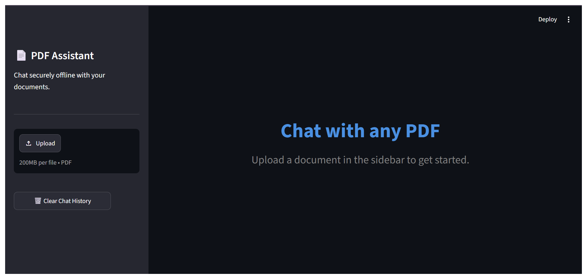
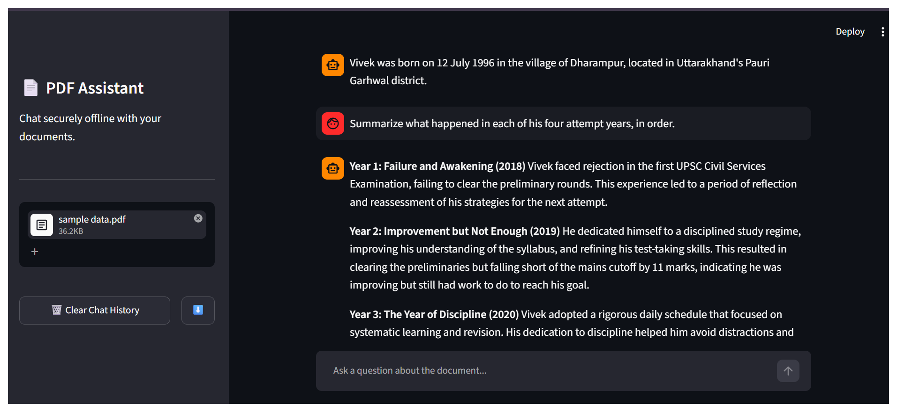

# 📄 Offline PDF Chatbot

A fully offline, privacy-preserving RAG (Retrieval-Augmented Generation) chatbot that lets you
upload a PDF and ask questions about it — no internet connection, cloud API, or external service
required at query time.

Built with **Streamlit**, **FAISS** (vector search), **HuggingFace sentence-transformers**
(local embeddings), and **Ollama** running **phi3** (local LLM inference).

> Developed as part of a **DRDO internship project** — see [Author & Submission Info](#-author--submission-info).

---

## 📑 Table of Contents

- [Features](#-features)
- [Tech Stack (LLM & RAG Framework)](#-tech-stack-llm--rag-framework)
- [Screenshots](#-screenshots)
- [How to Use](#-how-to-use)
- [Setup](#️-setup)
- [Deployment Notes — Local Only, By Design](#️-deployment-notes--local-only-by-design)
- [Architecture](#-architecture)
- [How It Was Evaluated](#-how-it-was-evaluated)
- [Known Limitation](#known-limitation)
- [Troubleshooting / FAQ](#-troubleshooting--faq)
- [Project Structure](#-project-structure)
- [Future Improvements](#-possible-future-improvements)
- [Author & Submission Info](#-author--submission-info)

---

## ✨ Features

- Upload any text-based PDF and chat with it in natural language
- Runs 100% locally/offline — no data ever leaves your machine
- Source attribution: shows which page(s) an answer was drawn from
- Query-aware retrieval: automatically widens context for "list all / summarize each" style
  questions, and falls back to feeding the *entire* document for short files, to avoid missing
  or blending information across sections
- Handles encrypted/corrupted PDFs and oversized documents gracefully
- Short conversational memory so follow-up questions work
- Clear "model not ready" screen if Ollama/phi3 isn't running, instead of a silent crash

---

## 🧠 Tech Stack (LLM & RAG Framework)

For quick reference in a report or viva:

| Component | What we used |
|---|---|
| **LLM (generation)** | `phi3:latest` (Microsoft Phi-3, ~3.8B parameters), run **locally via Ollama** |
| **RAG framework / orchestration** | LangChain (`langchain-text-splitters` for chunking) |
| **Embedding model** | `sentence-transformers/all-MiniLM-L6-v2` (HuggingFace, runs on CPU) |
| **Vector store / retriever** | FAISS (Facebook AI Similarity Search), in-memory, per session |
| **PDF parsing** | `pypdf` |
| **UI** | Streamlit |

This is a full **offline Retrieval-Augmented Generation (RAG)** pipeline — the same architectural
pattern used by cloud RAG products, just with every component (LLM, embeddings, vector index)
running locally instead of calling an external API. No document text or query ever leaves the
machine.

---

## 📸 Screenshots

**Landing screen — upload a PDF to get started:**



**Example Q&A with page-level source attribution:**



---

## 🚀 How to Use

1. Launch the app (`streamlit run app.py`) — you'll land on the **"Chat with any PDF"** screen.
2. Click **Upload** in the sidebar and select a PDF (up to 200MB).
3. Wait for the single-line **"📖 Reading your document..."** indicator to finish — this extracts
   text, splits it into chunks, and builds a local vector index.
4. Once you see **"✅ I have successfully read [filename]"**, type a question in the chat box
   at the bottom, e.g. *"Summarize what happened in each of the four years."*
5. The answer streams in live. Below each answer, expand **"📌 Sources used for this answer"**
   to see which page(s) of the PDF it was grounded in.
6. Use **🗑️ Clear Chat History** to reset the conversation, or the **⬇️** icon next to it to
   download the chat transcript.

---

## ⚙️ Setup

### 1. Prerequisites
- Python 3.10+
- [Ollama](https://ollama.com) installed locally

### 2. Install dependencies
```bash
pip install -r requirements.txt --break-system-packages
```

### 3. Pull the local model
```bash
ollama pull phi3:latest
```

### 4. Start Ollama's server (in a separate terminal)
```bash
ollama serve
```

### 5. Run the app
```bash
streamlit run app.py
```

The app will refuse to proceed (with clear instructions) if Ollama or the `phi3` model isn't
available, instead of failing silently.

---

## ⚠️ Deployment Notes — Local Only, By Design

This project is built to be a **fully offline, local-first** application, and that is intentional
— it's the whole point of the design (no data ever leaves the machine, no API keys, no internet
dependency at query time).

Because of that, **this app cannot run on public cloud hosts like Streamlit Community Cloud**,
and that is expected, not a bug:

- The app talks to Ollama at `localhost:11434` to run the LLM (`phi3`).
- On your own computer, `localhost` correctly points to Ollama running on that same machine.
- On a cloud host (e.g. Streamlit Cloud), `localhost` refers to *the cloud server itself* — which
  has no Ollama installed and no way to reach your laptop. So it will always show:
  > ⚠️ Model phi3:latest was not found, or the Ollama server isn't running.
- Cloud platforms like Streamlit Community Cloud also don't allow installing/running background
  services such as Ollama, so this limitation can't be worked around by "fixing" the deployment.

**Correct way to run/demo this project:** locally, following the [Setup](#️-setup) steps above
(`localhost:8501` with Ollama running alongside it). If a reviewer needs to see it working
without setting it up themselves, share the screenshots above or a short screen recording of a
local run, instead of a live public link.

---

## 🧱 Architecture

```
PDF upload
   │
   ▼
Text extraction (pypdf) ──► per-page text
   │
   ▼
Chunking (LangChain RecursiveCharacterTextSplitter, 1000 chars, 150 overlap)
   │
   ▼
Embeddings (sentence-transformers/all-MiniLM-L6-v2, CPU) ──► 384-dim vectors
   │
   ▼
Vector index (FAISS, in-memory, per-session)
   │
   ▼
User question ──► similarity search (or full-document context for short PDFs on
                   list/summary questions) ──► phi3 via Ollama (streamed) ──► answer
```

---

## 🧪 How It Was Evaluated

The app was tested against multiple real PDFs with a mix of question types to check for
faithfulness (i.e. that answers are grounded in the document and not hallucinated):

| Test type | Example question | Purpose |
|---|---|---|
| Basic fact retrieval | "When and where was X born?" | Sanity check |
| Specific numeric detail | "How much rent did X pay?" | Tests chunk precision |
| Enumeration | "List all 8 interview questions" / "list all his habits" | Tests whether the model invents/drops/merges items — a common small-LLM failure mode |
| Chronological summary | "Summarize what happened in each of the 4 years" | Tests whether details get misattributed to the wrong section |
| Negative test | "What college did he attend for his Master's?" (not in the document) | Confirms the model says *"The document does not provide this information"* instead of hallucinating |

The screenshot above (four-year summary) shows a corrected run after the full-document context
fallback was added — each year's details are now correctly attributed to the right label.

### Known limitation
Because this project intentionally uses a small (~3.8B parameter), CPU-only, fully local model
(`phi3`) rather than a large cloud model, it can occasionally misattribute a detail to the wrong
labeled section on very long or complex documents, even though it correctly refuses to answer
when information is genuinely absent. This is a known trade-off of prioritizing full offline
privacy over model size, and is mitigated (not fully eliminated) by:
- reordering retrieved chunks back into document order before prompting,
- widening retrieval for list/summary-style questions,
- falling back to full-document context for short PDFs, and
- explicit prompt instructions not to blend adjacent sections.

---

## 🛠 Troubleshooting / FAQ

**"Model phi3:latest was not found, or the Ollama server isn't running"**
Ollama isn't installed, isn't running, or the model hasn't been pulled yet.
```bash
ollama --version        # confirm it's installed
ollama serve             # start the server (keep this terminal open)
ollama pull phi3:latest  # in a second terminal — downloads ~2.3GB
ollama list               # confirm phi3:latest appears
```
Then reload the Streamlit page.

**It works on `localhost` but not on my Streamlit Cloud deployment link**
Expected — see [Deployment Notes](#️-deployment-notes--local-only-by-design) above. This app is
designed to run locally only.

**"No readable text found in this PDF"**
The PDF is likely a scanned image rather than real text. This app does not include OCR — use a
text-based PDF instead.

**Answers are slow / the app feels stuck while generating**
`phi3` on CPU can take 10–30 seconds to produce its first token, especially with longer context.
Watch for the *"🧠 Searching document..."* → *"💬 Generating answer..."* indicators — the app is
working, not frozen.

---

## 📁 Project Structure

```
.
├── app.py              # Main Streamlit application
├── requirements.txt    # Python dependencies
├── README.md
├── .gitignore
└── assets/
    ├── app-home.png       # Landing screen screenshot
    └── app-qa-demo.png    # Example Q&A with source attribution
```

---

## 🚀 Possible Future Improvements
- Support scanned/image-only PDFs via OCR
- Persist vector index to disk so re-uploading the same file skips re-embedding
- Multi-document chat (query across several PDFs at once)
- Configurable model selection (swap `phi3` for another locally pulled Ollama model)

---

## 👤 Author & Submission Info

- **Name:** Sakshi Shekhawat
- **Organization:** Defence Research & Development Organisation (DRDO)
- **Project:** Offline PDF Chatbot (RAG-based, local LLM inference)
- **Internship Duration:** June – July 2025
- **Guide / Mentor:** Sh. Umesh Kumar Chaturvedi, Sc.E